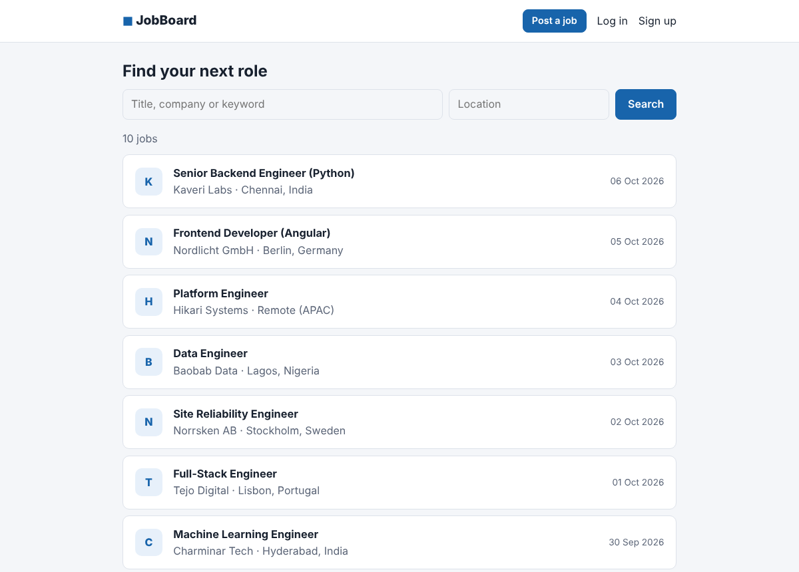
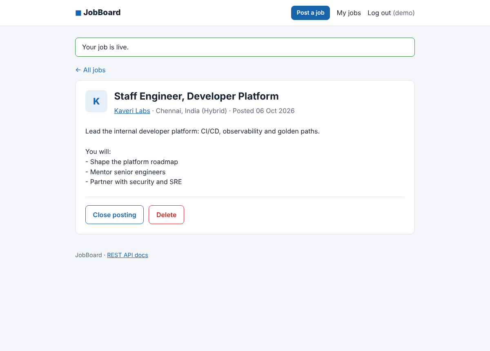
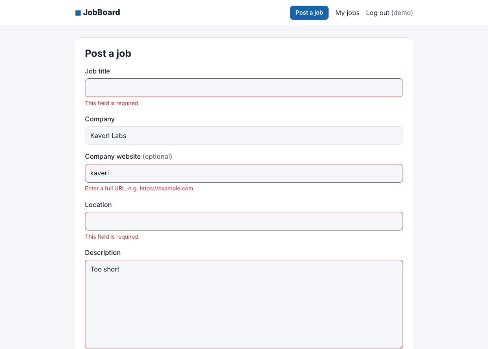

# JobBoard

[](https://github.com/imkarthiknr/JobBoard/actions/workflows/ci.yml)


A job board where employers post openings and candidates search them. It is built with **FastAPI**, **SQLAlchemy 2** and **PostgreSQL**, and ships both a **REST API** (JWT auth, OpenAPI docs) and a **server-rendered web UI** (Jinja2, no JavaScript framework).

The project started in 2022 as a FastAPI learning project: models, a database connection and password hashing, without any endpoints yet. In 2026 it was completed and rebuilt into a tested, containerised application. [CHANGELOG.md](CHANGELOG.md) has the history.

| Browse & search                          | Job posting (owner view)                         | Validation                                              |
| ---------------------------------------- | ------------------------------------------------ | ------------------------------------------------------- |
|    |    |  |

## Features

- **Search jobs** by keyword (title, company or description) and location, newest first, with pagination.
- **Accounts**: sign up and log in. Passwords are hashed with bcrypt, and usernames and emails are unique (case-insensitive).
- **Post, close, reopen and delete** your own jobs. Superusers can moderate any posting.
- **Closed postings** disappear from search and are visible only to their owner.
- **REST API** under `/api/v1` with OAuth2 password flow and JWT bearer tokens. Interactive docs are at `/docs`.
- **Web UI** shares the same service layer as the API. It uses an HttpOnly, SameSite=Lax JWT cookie, friendly form errors, flash messages, HTML error pages and auto-escaping.
- **Production basics**: Alembic migrations, a `/health` endpoint, Docker with a non-root user, and configuration through environment variables.

## Quick start

### Docker (app + PostgreSQL)

```bash
git clone https://github.com/imkarthiknr/JobBoard.git
cd JobBoard
docker compose up --build
```

Open <http://localhost:8000>. Demo data is loaded automatically. Log in as **`demo` / `jobboard123`**.

### Local (SQLite, zero setup)

You need Python 3.11+ and [uv](https://docs.astral.sh/uv/).

```bash
uv sync                          # create .venv and install dependencies
uv run alembic upgrade head      # create the schema (SQLite file ./jobboard.db)
uv run python -m app.seed        # optional demo data
uv run uvicorn app.main:app --reload
```

On Windows, install uv with `powershell -c "irm https://astral.sh/uv/install.ps1 | iex"`. The commands are the same in PowerShell.

## Architecture

```
            ┌──────────────── FastAPI app (app/main.py) ────────────────┐
 Browser ──▶│  web/routes.py  (Jinja2 pages, cookie auth)               │
            │                         │                                 │
 API client▶│  api/routes/*   (JSON, Bearer JWT)  ── api/deps.py        │
            │                         ▼                                 │
            │  services/      users.py · jobs.py   (business rules)     │
            │                         ▼                                 │
            │  models/        SQLAlchemy 2 ORM ──── migrations/ (Alembic)│
            └─────────────────────────┬─────────────────────────────────┘
                                      ▼
                         PostgreSQL (prod) · SQLite (dev/tests)
```

Both front doors, the HTML pages and the JSON API, call the same **service layer**, so rules such as "only the owner can delete" and "closed jobs are hidden" live in one place.

## API at a glance

| Method   | Endpoint                 | Auth   | Description                                    |
| -------- | ------------------------ | ------ | ---------------------------------------------- |
| `POST`   | `/api/v1/users`          | –      | Register                                       |
| `POST`   | `/api/v1/auth/token`     | –      | Log in (form: `username`, `password`) → JWT    |
| `GET`    | `/api/v1/users/me`       | Bearer | Current user                                   |
| `GET`    | `/api/v1/users/me/jobs`  | Bearer | My postings (including closed)                 |
| `GET`    | `/api/v1/jobs`           | –      | Search: `q`, `location`, `page`, `size`        |
| `GET`    | `/api/v1/jobs/{id}`      | –      | Job details                                    |
| `POST`   | `/api/v1/jobs`           | Bearer | Post a job → `201`                             |
| `PATCH`  | `/api/v1/jobs/{id}`      | Owner  | Partial update (incl. `is_active`)             |
| `DELETE` | `/api/v1/jobs/{id}`      | Owner  | Delete → `204`                                 |
| `GET`    | `/health`                | –      | Liveness                                       |

The full schema is at `/docs` (Swagger UI) and `/redoc` while the app is running. Examples are in [docs/API.md](docs/API.md).

## Project structure

```
JobBoard/
├── app/
│   ├── main.py              App factory, error handling, static files
│   ├── core/                Settings (pydantic-settings), bcrypt + JWT
│   ├── db/                  Declarative base, engine/session
│   ├── models/              User, Job
│   ├── schemas/             Pydantic request/response models
│   ├── services/            Business logic (no HTTP)
│   ├── api/                 REST routes + auth dependencies
│   ├── web/                 Jinja2 routes, templates, CSS
│   └── seed.py              Demo data
├── migrations/              Alembic environment + versions
├── tests/                   pytest (API, web, security, migrations)
├── Dockerfile · docker-compose.yml · docker-entrypoint.sh
├── pyproject.toml · uv.lock
└── DEVELOPMENT.md
```

## Testing

```bash
uv run pytest                                  # 46 tests on in-memory SQLite
TEST_DATABASE_URL=postgresql+psycopg://… uv run pytest   # same suite on PostgreSQL
uv run ruff check . && uv run ruff format --check .
```

CI runs lint, the test suite on SQLite (Python 3.11 and 3.13) and PostgreSQL 16, a migration-drift check, and a Docker Compose smoke test.

## Roadmap

See [DEVELOPMENT.md](DEVELOPMENT.md#roadmap): applications and saved jobs, editing postings in the UI, email verification, rate limiting and full-text search with PostgreSQL `tsvector`.

## License

[MIT](LICENSE) © Karthik N R
